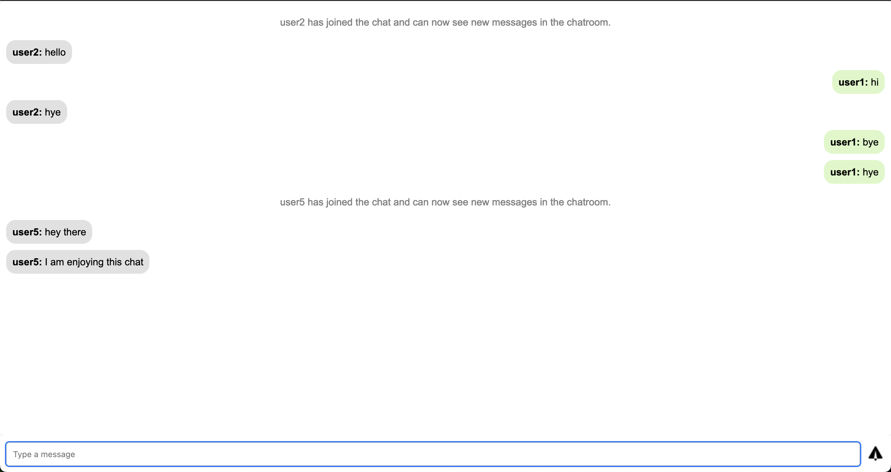
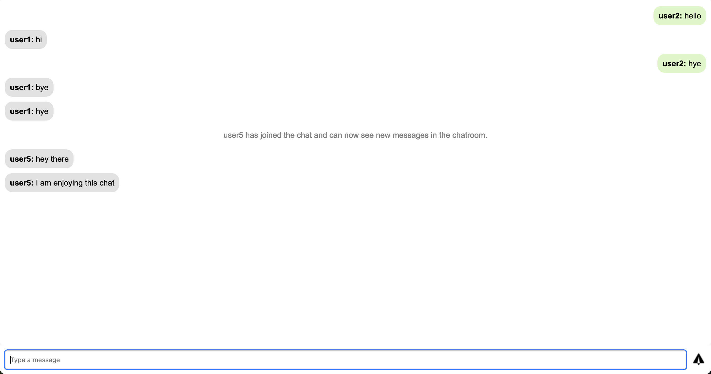

# Simple Chat App

A simple chat app using FastAPI websocket server for backend for understanding the workings of websocket.

 

# Getting Started

## Installation

Create a new virtual environment and activate it.

```bash
pyenv virtualenv 3.13.0 chat-server
pyenv activate chat-server
```

Install the required packages using the command:

```bash
pip install -r requirements.txt
```

## Running the chat app

Run the FastAPI server using the command:

```bash
uvicorn main:app --reload --port 8000
```

Serve the webpage in index.html using any server or simply open it in the webbrowser using its local path.
